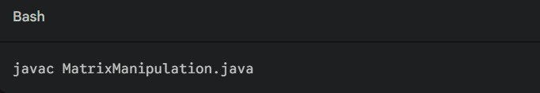
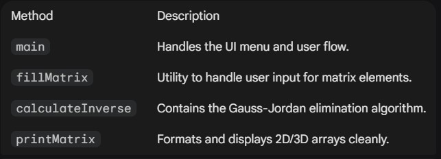
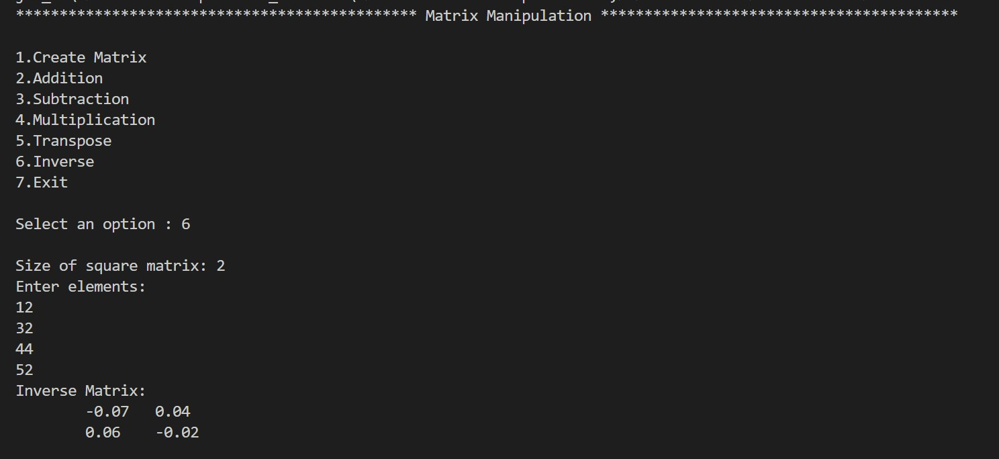

## 🧮 Matrix Manipulation Tool

A robust, console-based Java application designed to perform complex linear algebra operations with mathematical precision. This tool handles everything from basic matrix arithmetic to advanced operations like Gaussian Elimination for matrix inversion.

---

## 🚀 Features

- Create & Store: Initialize multiple matrices and view them in a structured grid format.
- Matrix Arithmetic: Addition and Subtraction of matrices.
- Standard Matrix Multiplication: Implements the true dot product logic.
- Geometric Operations: Rapidly compute the Transpose of any rectangular matrix.
- High Precision Inverse: Uses the Gauss-Jordan elimination method to find the inverse of square matrices with double precision (2 decimal places).
---

## 🛠️ Logic & Mathematics

- The core of this application follows strict mathematical rules:

# Matrix Multiplication :
  - Unlike element-wise multiplication, this tool uses the standard algorithm:
    .jpg)
    
# Matrix Inversion
- The program uses an Augmented Matrix [A | I ] approach. Through row operations, it transforms the left side into the Identity matrix, leaving the inverse on the right.

---

## 💻 How to Run

- Prerequisites: Ensure you have JDK installed.
- Compile:
    
- Execute:
    

---

## 📂 Project Structure

---

## 📝 Example Usage

---

## 🤝 Contributing

Contributions are welcome! If you'd like to add features like Determinant calculation or Eigenvalues, feel free to fork this repo and submit a pull request.
